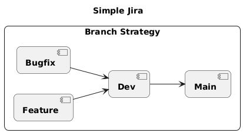
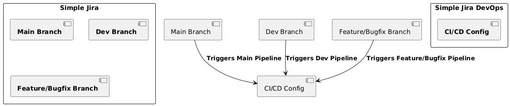
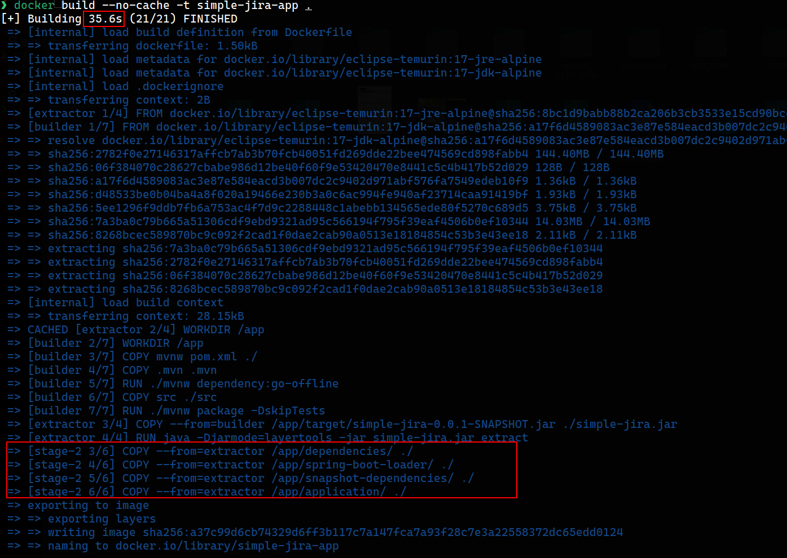
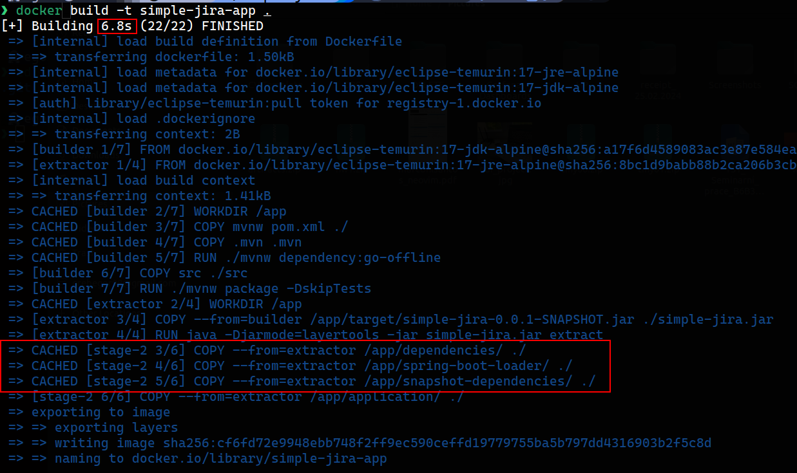
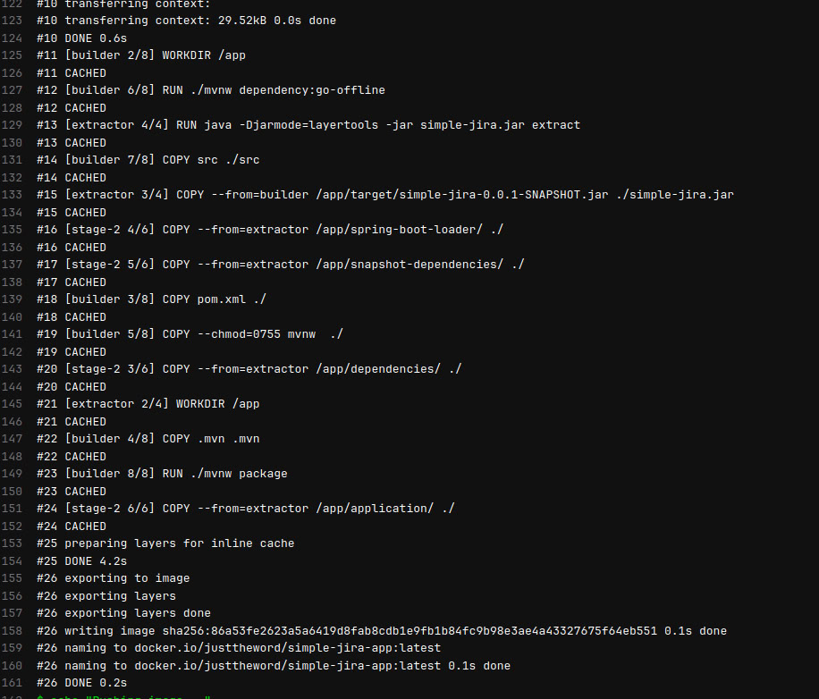
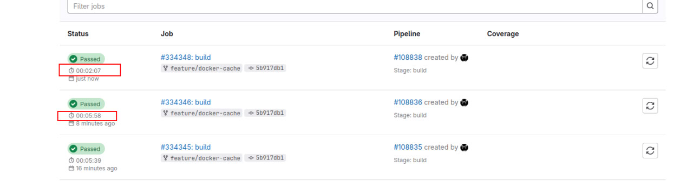
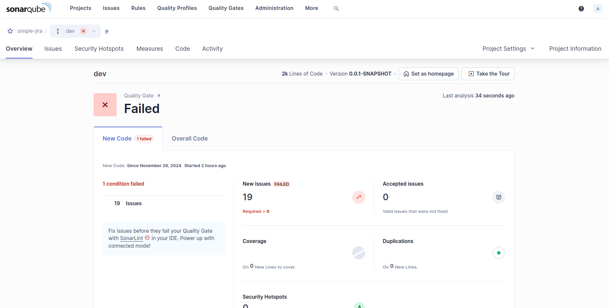
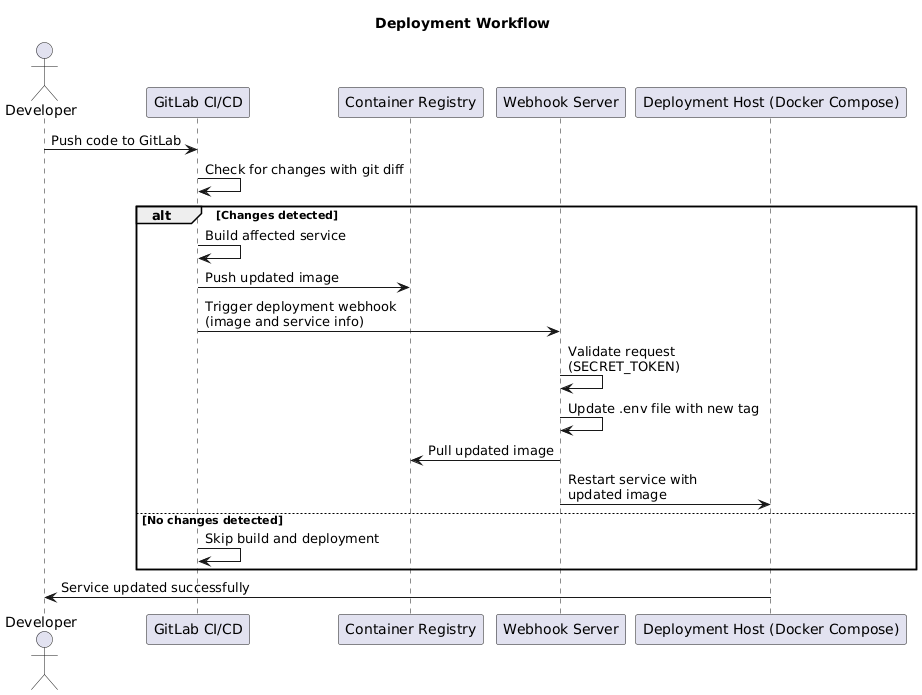
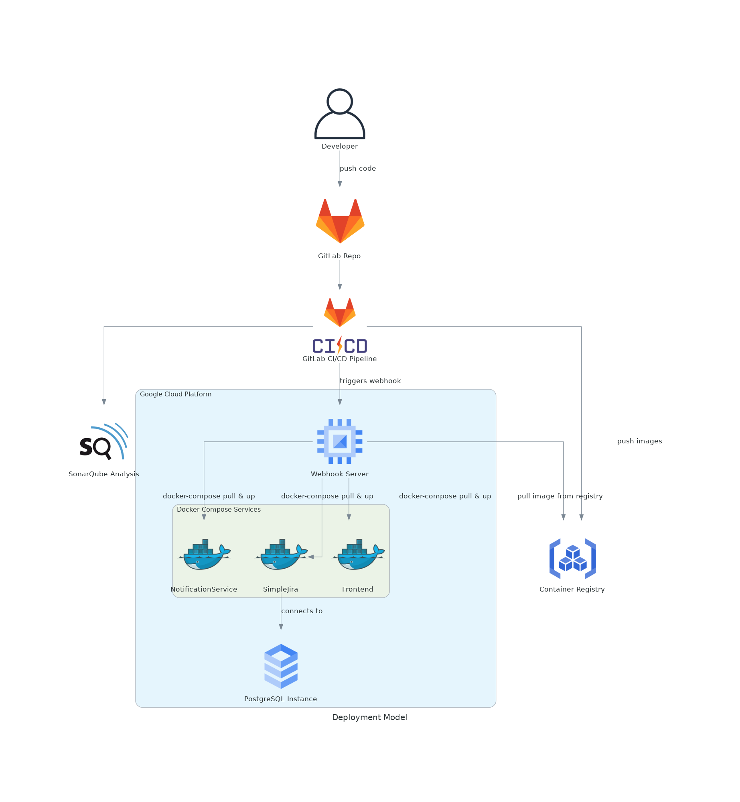
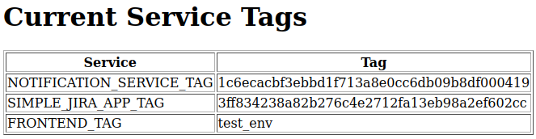

# Simple Jira DevOps

The **Simple Jira DevOps** repository provides a centralized CI/CD configuration for the [**Simple Jira**](https://gitlab.fel.cvut.cz/grebegor/simple-jira) project.

<kbd>
  
</kbd>

# Content

- [Content](#content)
- [Description](#description)
- [Evolution to Microservices](#evolution-to-microservices)
- [Branch Strategy](#branch-strategy)
- [CI and CD](#ci-and-cd)
  - [Key Features of CI and CD](#key-features-of-ci-and-cd)
- [Containerization](#containerization)
  - [Key Features of Containerization](#key-features-of-containerization)
  - [Build Time Comparison](#build-time-comparison)
- [Code Quality Analysis](#code-quality-analysis)
  - [Integration](#integration)
  - [Key Features of CQA](#key-features-of-cqa)
- [Deployment](#deployment)
  - [Workflow Overview](#workflow-overview)
  - [Systemd-Managed Webhook Server](#systemd-managed-webhook-server)
  - [Deployment Workflow Diagram](#deployment-workflow-diagram)
  - [Deployment Model](#deployment-model)
  - [Key Features of Deployment](#key-features-of-deployment)
  - [Checking Service Tags](#checking-service-tags)
    - [Key Details](#key-details)
    - [Example](#example)
    - [Usage](#usage)

## Description

This repository automates the build, testing, and deployment processes for each branch of [Simple Jira](https://gitlab.fel.cvut.cz/grebegor/simple-jira). Using GitLab CI/CD, it ensures the DevOps pipeline is efficient and standardized across all branches. It includes all deployment scripts and configurations, enabling rapid and consistent deployments across environments.

## Evolution to Microservices

The evolution of the **Simple Jira** project from a monolithic architecture to a microservices-based design motivated significant updates to the CI/CD configuration. These changes aim to address the following challenges:

1. **Efficient Builds**:

   - Previously, the monolithic architecture required rebuilding the entire application for any code change. With the microservices model, we implemented module-specific builds, ensuring only the affected service is rebuilt and deployed.

2. **Scalability**:

   - A microservices architecture scales better for growing application demands. The updated CI/CD pipeline reflects this by introducing separate build and deployment configurations for each service.

3. **Reduced Build Times**:

   - By leveraging `git diff`, the pipeline identifies changes at the module level, avoiding unnecessary builds and optimizing pipeline execution times.

4. **Selective Deployment**:
   - Each service is now independently built and deployed, enabling faster updates and isolating issues to specific services without affecting the entire application.

These updates not only improve efficiency but also align the project with industry best practices for managing microservices architectures.

## Branch Strategy

Our branch strategy follows a `feature-driven` development model where `feature and bugfix` branches are integrated into the `dev` branch, which later merges into the `main` branch. This ensures a smooth workflow and maintains code quality during the development lifecycle.

<kbd>
  
</kbd>

## CI and CD

The **Simple Jira DevOps** CI/CD pipeline handles different stages such as `testing`, `building`, and `deploying` services based on branch changes. It is `designed to handle modular microservices`. Each branch triggers a specific pipeline configuration to ensure that the right actions are executed based on the code lifecycle phase ([see Branch Strategy](#branch-strategy)).

<kbd>
  
</kbd>

### Key Features of CI and CD

- **Branch-Specific Pipelines**:

  Different branches trigger specific pipelines:

  - **Main Branch**: Triggers the full production pipeline for final deployment.
  - **Dev Branch**: Triggers a pipeline for test environment.
  - **Feature/Bugfix Branches**: Triggers pipelines for testing and building images without pushing to production.

---

- **Selective Service Builds**:

  The pipeline leverages `git diff` to detect changes in specific service directories (e.g., `NotificationService/`, `SimpleJira/`, `Frontend/`). Only the affected services are rebuilt and redeployed, optimizing CI/CD execution times.

---

- **Modular Builds**:

  Separate jobs exist for each service, including:

  - **Notification Service**: Builds and deploys independently.
  - **Simple Jira App**: Builds and deploys independently.
  - **Frontend**: Builds and deploys independently.

---

- **Inline Docker Caching**:

  Inline caching with `BUILDKIT_INLINE_CACHE=1` allows Docker to reuse image layers, improving build efficiency.

---

- **Deployment Webhooks**:

  A webhook server, managed via `systemd`, receives deployment triggers post-build to update and restart the relevant services using `docker-compose`.

## Containerization

We utilize a **multi-stage Dockerfile** to optimize the build and runtime environment for our Spring Boot application. The process is split into three stages:

- **Builder stage**: Uses Maven to build the application.
- **Extractor stage**: Separates dependencies and application layers using Spring Boot's `layertools`, improving build performance.
- **Final stage**: Assembles a minimal JRE-based image for runtime, reducing the image size.

### Key Features of Containerization

- **Layered Caching**: Dependencies are cached separately from the application code, speeding up rebuilds during CI/CD runs.
- **Optimized Image Size**: By using a minimal JRE image in the final stage, we keep the runtime footprint as small as possible.

### Build Time Comparison

Docker caching significantly impacts build times, as illustrated below.

- **Without Cache**:

  <kbd>
    
  </kbd>

- **With Cache**:

  <kbd>
    
  </kbd>

---

- **Cache during CI/CD**:

  <kbd>
    
  </kbd>

---

- **Cold Cache and Warm Cache during CI/CD**:

  <kbd>
    
  </kbd>

## Code Quality Analysis

To ensure high-quality code standards, we have integrated **SonarQube** into the CI/CD pipeline. SonarQube performs static code analysis, identifying potential issues such as code smells, bugs, and security vulnerabilities.

### Integration

SonarQube is triggered as part of the CI pipeline after the build stage. The results are published in the SonarQube dashboard for review and action.

<kbd>
  
</kbd>

### Key Features of CQA

- **Static Code Analysis**: Detects and reports on code quality issues.
- **Security Insights**: Highlights potential vulnerabilities in the code.
- **Branch-Level Insights**: Provides detailed analysis for each branch to ensure code quality is maintained during the development lifecycle.

## Deployment

The deployment process for **Simple Jira DevOps** leverages a webhook-based approach integrated with the CI/CD pipeline to automate the deployment of updated Docker images. Each service's deployment is triggered only when changes are detected during the build stage, ensuring efficient and targeted updates.

### Workflow Overview

1. **Build Detection**:

   - During the build stage, the pipeline uses `git diff` to detect changes in the respective service directories (e.g., `NotificationService/`, `SimpleJira/`).
   - If changes are found, the service is rebuilt, and the Docker image is pushed to the container registry.

2. **Trigger Deployment**:

   - After pushing the Docker image, the pipeline triggers a deployment webhook.
   - The webhook informs the deployment server of the updated image and the service to deploy.

3. **Webhook Server**:
   - A Python Flask-based webhook server runs on the deployment host.
   - The server performs the following actions:
     - Validates the incoming request using a shared secret token.
     - Updates the environment file with the new image tag.
     - Pulls the updated image using `docker pull`.
     - Restarts the affected service using `docker-compose up -d`.

### Systemd-Managed Webhook Server

The webhook server is managed by `systemd` for reliability and ease of use. It ensures the server:

- Starts automatically on system boot.
- Restarts if it crashes.
- Can be easily managed using standard `systemd` commands.

### Deployment Workflow Diagram

<kbd>
  
</kbd>

## Deployment Model

The following diagram represents the **Deployment Model** for the Simple Jira project, showing how all components interact, including GCP integration, the PostgreSQL database, the webhook server, and the Docker Compose-managed microservices.

<kbd>
  
</kbd>

### Key Features of Deployment

- **Selective Deployment**:
  - Only services with changes are rebuilt and deployed.
- **Automation**:
  - Deployment is triggered automatically post-build, with no manual intervention required.
- **Reliability**:
  - The webhook server is managed by `systemd`, ensuring it runs reliably in production.

### Checking Service Tags

To facilitate developers in verifying the current tags of Docker images for each service, we have implemented a **Service Tag Viewer** accessible via the deployment environment. This viewer displays the tag associated with each service.

#### Key Details

- **Feature Branches**: Tags correspond to the commit SHA (`$CI_COMMIT_SHA`) and are deployed to isolated feature environments.
- **Dev and Main Branches**: Tags are always `latest`.
  - The `dev` tag is deployed to the test environment.
  - The `main` tag is deployed to production.

#### Example

<kbd>
  
</kbd>

In the example above:

- **NOTIFICATION_SERVICE_TAG**: Points to the commit SHA for a feature branch deployment.
- **SIMPLE_JIRA_APP_TAG**: Reflects the commit SHA for a specific build.
- **FRONTEND_TAG**: Indicates the `test_env` environment for development.

#### Usage

Developers can refer to this viewer to:

1. Verify the tag of the deployed image for a specific service.
2. Cross-check the environment where the service is running (`feature`, `dev`, or `main`).

This mechanism ensures transparency and simplifies debugging during development and deployment.
